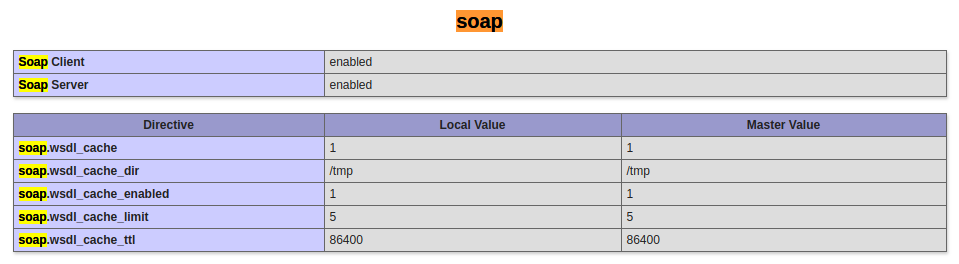

# 4impact
Toools for social listening and data visualization


# Library

1. ZKSoftware:

+ https://github.com/cobisja/tad-php

Requirement: 

* Soap php enable
* soap-client for php installed



https://github.com/hofmannsven/cleverreach-extension/wiki/PHP-SOAP-Extension

```bash
 1627  php-soap
 1628  sudo apt-get install php-soap
 1633  soap
 1634  php-soap
 1635  soap
 1640  soap
 1642  php-soap
 1643  sudo apt-get install php-nusoap
 1644  php -i | grep -i soap
 1645  php --enable-soap
 1648  php -m | grep -i soap
 1660  composer install artisaninweb/laravel-soap:0.3.*
 1663  composer require artisaninweb/laravel-soap:0.3.*
 1664  composer remove artisaninweb/laravel-soap:0.3.*
 1668  pecl search soap
 1671  pecl search soap
 1681  sudo apt-get install  php5-soap
 1682  sudo apt-get install  php5.6-soap
 1691  cat soap.ini 
 1692  php5.6-soap
 1703  php -m | grep -i soap
 1709  sudo pear install php-soap
 1710  pear search soap
 1733  sudo apt-get install php-soap
 1738  php -i | grep -i soap
 1739  grep -r "soap.dll" /etc/php/7.0/cli/
 1740  grep -r "soap.dll" /etc/php5.6/cli/
 1741  grep -r "soap.dll" /etc/php/5.6/cli/
 1758  mv Downloads/php_soap.dll /usr/lib/php/20131226/
 1759  sudo mv Downloads/php_soap.dll /usr/lib/php/20131226/
 1765  rm /usr/lib/php/20131226/php_soap.dll 
 1766  sudo rm /usr/lib/php/20131226/php_soap.dll 
 1773  sudo cp 20160303/soap.so 20131226/php_soap.dll
 1780  sudo rm /usr/lib/php/20131226/php_soap.dll 
 1783  sudo apt-upgrade php-soap
 1795  pkgfile -v soap.so
 2008  history | grep soap
```


# Scan UDP port: 

nmap  -p4370 192.168.100.*
